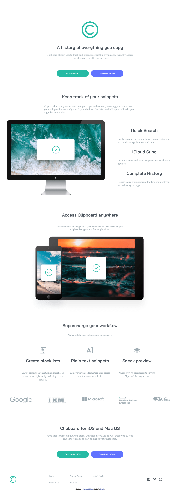

# Frontend Mentor - Clipboard landing page solution

This is a solution to the [Clipboard landing page challenge on Frontend Mentor](https://www.frontendmentor.io/challenges/clipboard-landing-page-5cc9bccd6c4c91111378ecb9)

### The challenge

Users should be able to:

- View the optimal layout for the site depending on their device's screen size (accomplished)
- See hover states for all interactive elements on the page (accomplished)

### Screenshot of my solution

<!-- ### Links

- Solution URL: [Add solution URL here](https://your-solution-url.com)
- Live Site URL: [Add live site URL here](https://your-live-site-url.com) -->

## My process

### Built with

- Semantic HTML5 markup
- CSS custom properties
- Flexbox

## Author

<!-- - Website - [Add your name here](https://www.your-site.com) -->
<!-- - Frontend Mentor - [@yourusername](https://www.frontendmentor.io/profile/yourusername) -->
- Twitter - [@josephdotpy](https://www.twitter.com/josephdotpy)

